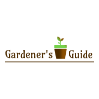
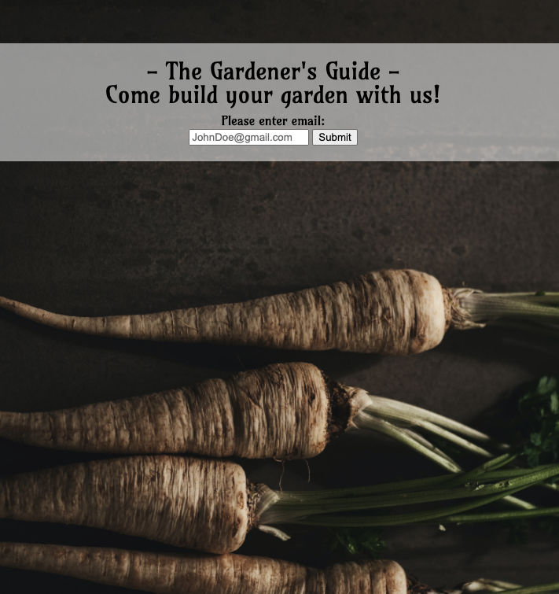
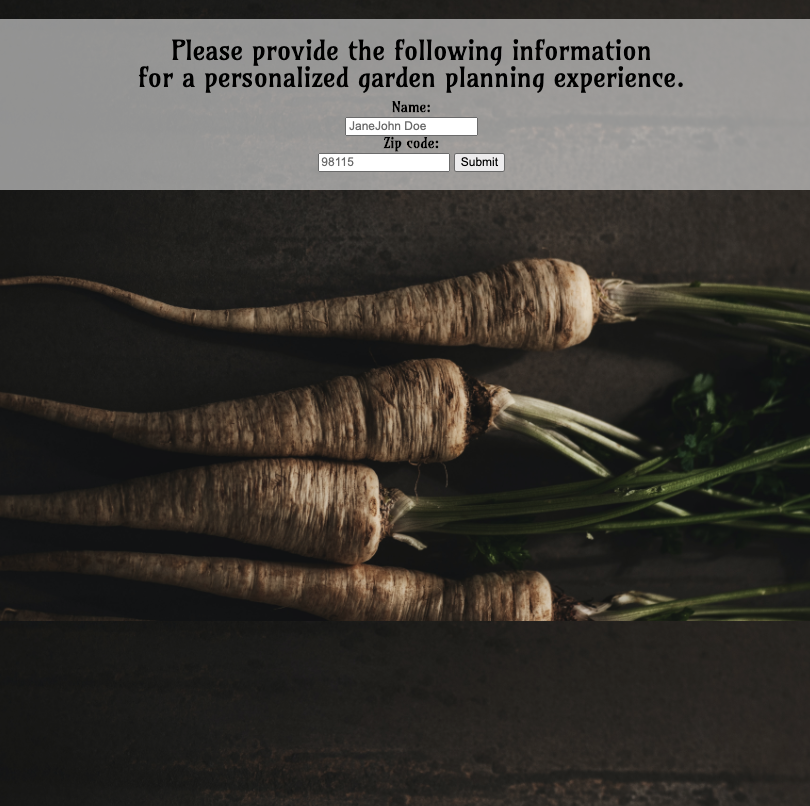
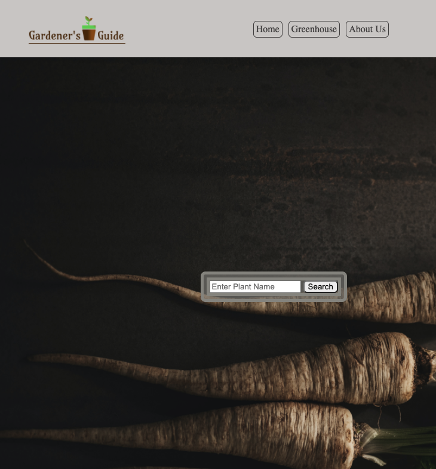
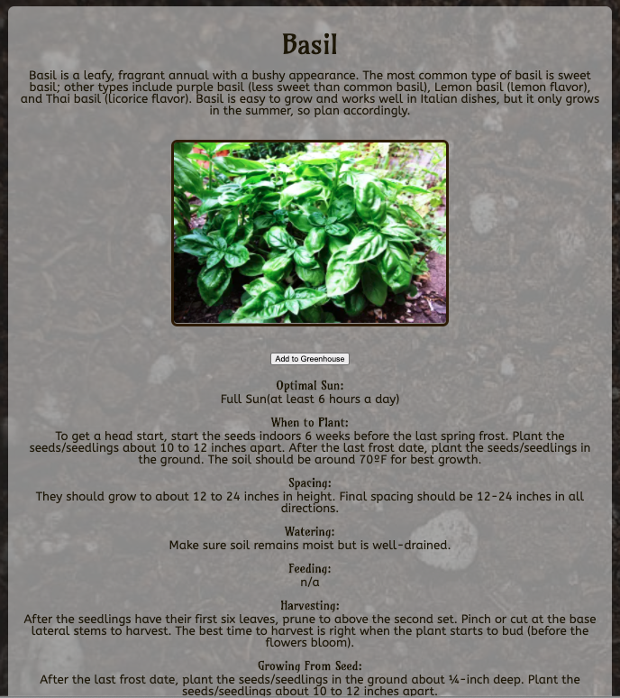
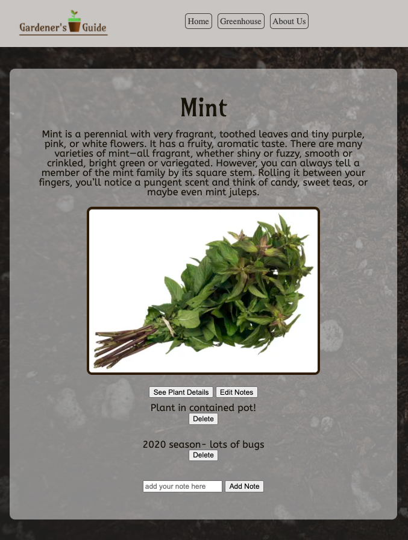
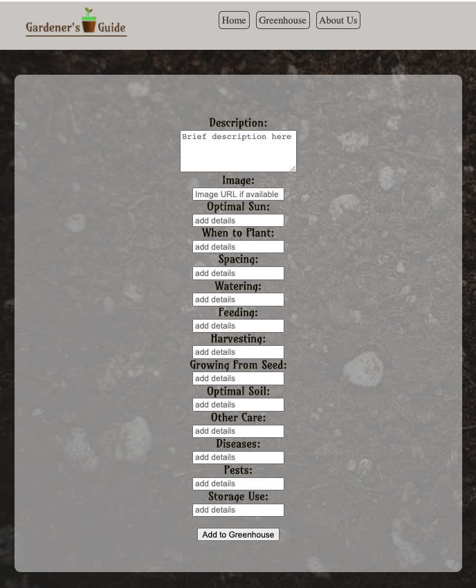

  

## Authors    
Meghan Domeck - [GitHub](https://github.com/mdomeck) || [LinkedIn](https://www.linkedin.com/in/meghan-domeck/)   
Hexx King - [GitHub](https://github.com/HexxKing) || [LinkedIn](https://www.linkedin.com/in/hexx-king/)   
David Dicken - [GitHub](https://github.com/daviddicken) || [LinkedIn](https://www.linkedin.com/in/david-dicken/)    
Tia Low - [Github](https://github.com/TiaLow) || [LinkedIn](https://www.linkedin.com/in/tia-low/)   

## Version 
1.0.2 

## Overview
- App provides information for keeping plants and a garden alive in different growing conditions
- Unique user experience with a login
- Search API for plants and get relevant information
- Save plants to your own greenhouse and be able to access it later
- Functionality to add notes and update them

## Features

## Getting Started
- .env file using envSamples as a template
- **npm install** the following:
  - dotenv
  - ejs
  - express
  - method-override
  - superagent
- create database named plants using postgres
- connect the schema file with the database

## Architecture
- HTML, CSS, JavaScript, jQuery, SQL, ejs
- Express server

**Resources**:
- https://www.w3schools.com/howto/howto_css_image_overlay.asp
- https://www.freelogodesign.org/
- https://github.com/damwhit/harvest_helper
- http://api.weatherbit.io/v2.0/forecast/daily
- https://unsplash.com/  
- https://viliusle.github.io/miniPaint/