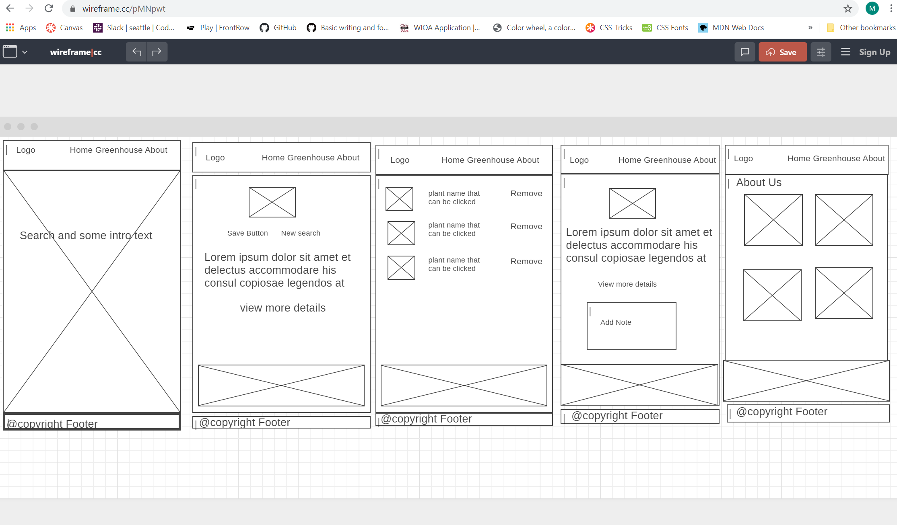
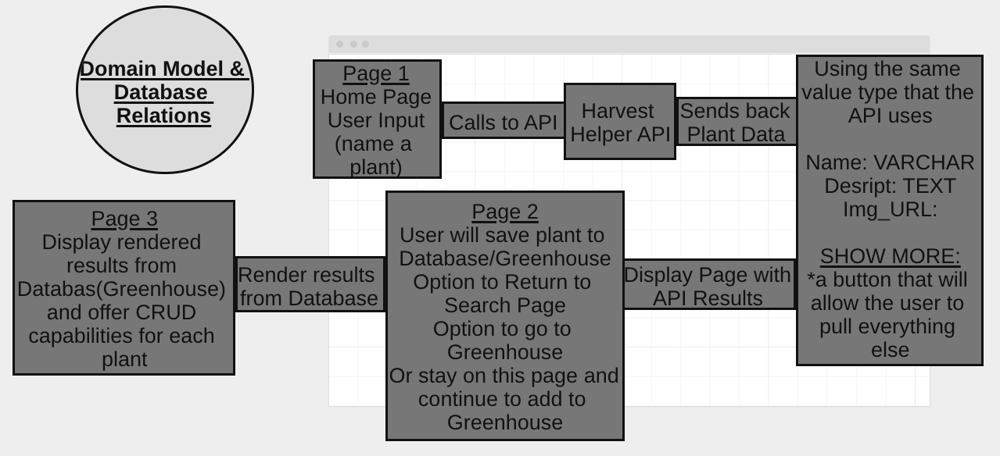

# Vision

## This is a tool to help you indentify and understand the growing requirments for each plant.
## This tool will also allow you to save to a collection that you can view later.

# Pain point solved
* Simplifies information needed to create a home garden.

# You should care about our product if you would like to have a self-sustaining life skill.

# Scope in/out

## Feature 1
* Search for plant / get information.

## Feature 2
* Save the plant to database collection.

## Feature 3
* Ability to save notes about each plant in database.

## Feature 4
* Ability to remove plants from database collection.

## Feature 5
* Ability to find out more about the developers.

## MVP
* See features 1-5

## Stretch Goals
* Full about us page(pics, links to past projects)
* Sort by sun/shade and/or geolocation
* Plan custom garden bed size/shape/layout
* Pinging a weather API that will notify you of heat or cold snaps
* Toxic and space garden with animations
* Uniquely identify user so they can log back in and see individual greenhouses
* On results page user could click "more info" / "continue reading" button that would reveal more info recieved from api

# Our product will not:
* Give information about plants not in the API.
* Our product will not be for profit. (No ads)

# Data Flow
* User arrives at home page and enters a plant name to be searched
* Harvest Helper API returns back Plant Data
* Results from API are rendered on Page 2
* User will save plant to Database/Greenhouse
* Display rendered results from Database(Greenhouse) on Page 3 and offer CRUD capabilities for each plant

# Non-Functional Requirements
* User can search for a plant and will recieve a response if plant is not in database or input is invalid.
* Our project will be testable by the user saving one plant to the database and being imediately able to go to the collection page to view saved result.
* Provided buttons will show imediate testability by removing plant from collection.
* Having a user log in will prevent people from spying into your greenhouse!

# Wireframe

# Domain Model

